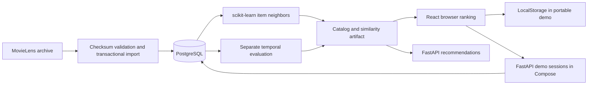

# Architecture

SignalRank has one React interface and two runtime modes. The public portfolio demo uses
browser-local preferences and a Python-generated model artifact. The full-stack Compose
mode stores isolated visitor profiles in PostgreSQL and exposes the same ranking through
FastAPI. The public demo does not claim to be a hosted Python/PostgreSQL service.

## Data flow



Compose starts credential initialization, PostgreSQL, migrations/import/training, API, then
Nginx. Readiness gates prevent the UI from opening on an uninitialized database. Credentials
are generated in a private Docker volume; no secrets enter source control or frontend code.
App containers run as nonroot. PostgreSQL is not exposed on a host port.

## Schema and provenance

- `movies`, `genres`, `movie_genres`: normalized catalog metadata.
- `dataset_ratings`: public pseudonymous MovieLens identities, movie, rating, timestamp.
- `dataset_imports`: archive SHA-256, actual source, timestamp, counts.
- `demo_sessions`: random profile ID, hashed token, expiry, JSON preference document.

Application identities are separate from public MovieLens IDs. A small bounded JSON document
is a deliberate demo simplification: ratings, likes, saves, and genre preferences update
atomically. A larger multi-device application should normalize interactions and use optimistic
concurrency rather than last-write-wins profile replacement.

The importer validates IDs, duplicates, referenced movies, rating increments, and timestamps.
Archive and member limits bound memory. It reads archive members without extracting paths.
A PostgreSQL advisory lock serializes imports; data rows and the completion record share a
transaction. Repeated initialization checks checksum/counts and does not duplicate ratings.

The canonical archive hash is pinned from [TensorFlow Datasets](https://raw.githubusercontent.com/tensorflow/datasets/master/tensorflow_datasets/url_checksums/movielens.txt).
The original GroupLens HTTPS endpoint had an expired certificate during this run. A TLS-verified
HTTPS mirror is accepted only for the same pinned bytes. Different URLs or hashes do not
silently use this fallback. Source and checksum are retained, along with the original README.

## Recommendation algorithm

Build an item-by-user sparse matrix from `max(rating - 2.5, 0)`. Fit scikit-learn
`NearestNeighbors(metric="cosine", algorithm="brute")`. Retrieve up to 40 neighbors per item,
exclude self/zero similarity, and compute in batches of 256 to avoid a dense all-pairs matrix.

For each rated/liked/saved reference movie, compute:

```text
reference weight = (rating - 3) / 2, or 0 when unrated
                 + 0.60 when liked
                 + 0.35 when saved
```

Positive weights contribute `weight × cosine similarity` to related movies. Normalize each
candidate's accumulated similarity by the largest candidate total. All nonzero weights,
including negative ones, contribute to the reference movie's genres. Selected genres add 2.
Candidate genre affinity averages its genre weights and divides by the largest absolute
genre weight. Community quality is `(rating sum + 20 × global mean) / (count + 20) / 5`.

```text
score = 0.60 × normalized similarity
      + 0.25 × genre affinity
      + 0.15 × smoothed community quality
```

Exclude rated movies from For You. Break ties by rating count then movie ID. Zero-history
profiles rely on community quality unless they select genres. Items with no positive ratings
can still match genres. A save indicates interest; it is not treated as a five-star rating.

The explanation names the reference movie with the strongest actual similarity contribution,
or matching preferred genres, or the community fallback. The panel shows weighted score
components rather than confidence percentages. These weights are design choices, not measured
causal importance. Python and TypeScript implementations have top-24 parity checks on three
profiles using the real artifact.

## Evaluation

Use a single global timestamp cutoff at the 80th percentile. All similarities, popularity
statistics, and candidate eligibility come from training ratings only. Movie genres are
intrinsic metadata. A relevant held-out item has rating ≥4 and exists in the training catalog.
A user is eligible with ≥5 training ratings and ≥1 relevant held-out item. Excluded users and
the training catalog denominator are reported. There is no parameter tuning on this holdout.

Precision@10 is hits/10; recall@10 is hits/relevant held-out items; aggregate values are macro
averages over eligible users. Coverage is unique recommended items/training-catalog items.
Both hybrid and smoothed-popularity baseline share the same users, candidates, and exclusions.
Results are in `evaluation.json`. The small eligible cohort (28 users) makes these a portfolio
experiment, not a research benchmark or production engagement measurement.

After separate evaluation, fit the serving artifact on all available ratings. New application
interactions rerank immediately without retraining collaborative neighbors. Replacing a model
requires restarting the API because its loader caches the artifact.

## Sessions, state, and deployment boundaries

Compose uses opaque random session cookies, hashes stored in PostgreSQL, seven-day expiry,
revocation, HttpOnly/SameSite cookies, explicit Origin checks, and input limits. Demo profiles
start with five disclosed example ratings. A bounded per-process rate limiter guards new
sessions; expired records are cleaned when a new session is created. Public server operation
would require shared rate limiting, proxy-aware secure cookie configuration, and scheduled
cleanup. The current API is intentionally loopback-only in Compose.

The portable public demo contains catalog metadata, aggregate movie statistics, and learned
item similarities, without raw user ratings or live database credentials. Preferences stay
in each visitor's browser and do not sync. Closing a tab retains them unless browser storage
is cleared; private browsing/storage restrictions may prevent persistence. The Model page
states the running mode explicitly.

## Tradeoffs and future improvements

- Sparse nearest neighbors are interpretable and suitable here; large catalogs need approximate
  retrieval, background jobs, memory budgets, and versioned artifact rollout.
- Browser ranking avoids accounts and hosted database costs for portfolio visitors, but downloads
  the model artifact and exposes its algorithm. It is not a substitute for a hosted full-stack API.
- Static metadata and MovieLens ratings are historical (through 2018), with selection/popularity
  bias. No current availability, trends, causal engagement, or streaming claims are made.
- SQLite unit tests are fast; actual PostgreSQL smoke checks verify deployment-specific behavior.
- Future additions: normalized event history, diversity constraints, matrix factorization,
  account sync, backups, monitoring, and online evaluation with real traffic and a sound design.
